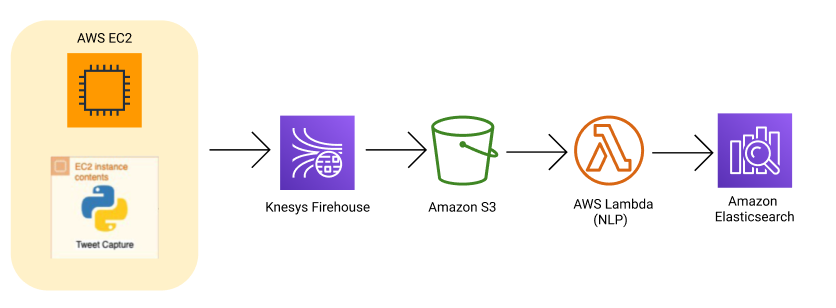

## Pipeline de dados

O pipeline foi definido utilizando a infraestrutura, mecanismos de coleta e armazenamento discutidas anteriormente. Como pode ser vista abaixo:

Esta pipeline e constituída por um script rodando em uma instância EC2, que alimenta uma stream de dados no Kinesys onde esses dados são salvos num bucket S3. Para em um momento posterior serem processados por uma função Lambda e seus resultados serem salvos no Elasticsearch.

[voltar para home](index.md)