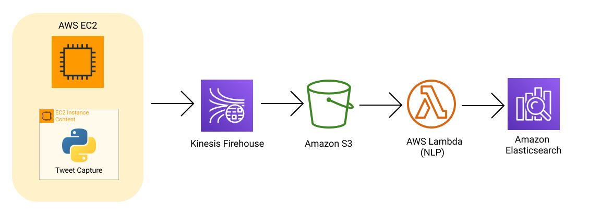

## Pipeline de dados

O pipiline foi definido utilizando a infraestrutura, mecanismos de coleta e armazenamento discutidas anteriormente. Como pode ser vista abaixo:

Esta pipiline e constituida por um script rodando em uma instancia EC2, que alimenta uma stream de dados no Kinesys onde esses dados sao salvos num bucket S3. Para em um momento posterior serem processados por uma função Lambda e seus resultados serem salvos no Elasticsearch.